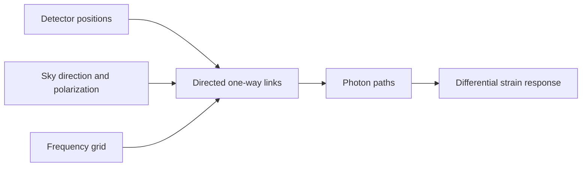

# JAX GW

JAX GW builds frequency-dependent gravitational-wave detector responses from
detector geometry. Define ground-based or cartwheeling space-detector
positions, evaluate the polarized response of every directed photon link, and
combine those links into arbitrary paths or differential strain readouts—all
as JAX arrays.



Changing the photon paths lets the same calculation describe different
interferometer geometries, including Michelson-style combinations.

## Install

The package currently requires Python 3.12. Clone the repository, then use a
separate [uv](https://docs.astral.sh/uv/) project as the runnable environment:

```bash
git clone https://github.com/IonMich/jax-gw.git
cd jax-gw
uv init --bare --no-workspace --python 3.12 ../jax-gw-demo
uv add --project ../jax-gw-demo --editable .
```

This keeps environment metadata outside the checkout while installing the
source tree in editable mode. The repository is the current public
distribution point.

## From photon paths to a Michelson response

Save the following as `detector_response.py`:

```python
import jax

jax.config.update("jax_enable_x64", True)

import jax.numpy as jnp

from jax_gw.detector.orbits import (
    flatten_pairs,
    get_arm_lengths,
    get_separations,
)
from jax_gw.detector.pixel import get_directional_basis
from jax_gw.detector.response import (
    get_differential_strain_response,
    get_path_response,
    response_pipe,
)

frequencies_hz = jnp.array([1.0e-3, 2.0e-3, 3.0e-3])
sky_basis = get_directional_basis(
    ecl_theta=jnp.array([jnp.pi / 3]),
    ecl_phi=jnp.array([jnp.pi / 4]),
)

# One vertex and two perpendicular, equal arms. Shape: (node, xyz, time).
arm_length_au = 2.5e9 / 149_597_870_700
positions_au = jnp.array(
    [[0.0, 0.0, 0.0], [arm_length_au, 0.0, 0.0], [0.0, arm_length_au, 0.0]]
)[:, :, None]
link_response, antenna_patterns = response_pipe(
    positions_au,
    frequencies_hz,
    sky_basis,
)

# Compare two equal-length round trips from spacecraft 0.
arm_lengths_au = get_arm_lengths(flatten_pairs(get_separations(positions_au)))
paths = jnp.array([[0, 1, 0], [0, 2, 0]])
path_response, cumulative_length_au = get_path_response(
    paths,
    frequencies_hz,
    arm_lengths_au,
    link_response,
)
assert jnp.allclose(cumulative_length_au[:, 0, -1], cumulative_length_au[:, 1, -1])
differential_strain = get_differential_strain_response(
    path_response,
    0,
    1,
    cumulative_length_au,
)

print("links:", link_response.shape, link_response.dtype)
print("paths:", path_response.shape)
print("differential strain:", differential_strain.shape)
print("finite:", bool(jnp.all(jnp.isfinite(differential_strain))))
```

Run it from the checkout:

```bash
uv run --project ../jax-gw-demo "$PWD/detector_response.py"
# links: (6, 1, 1, 3, 2) complex128
# paths: (2, 1, 1, 3, 2)
# differential strain: (1, 1, 3, 2)
# finite: True
```

The link and path axes are `(directed link or path, time, sky position,
frequency, polarization)`; the differential response drops the path axis.
Frequencies are in Hz, times are in years, and positions and arm lengths are in
AU. The last axis contains plus and cross polarization. Link and path responses
are timing responses in seconds per unit metric amplitude; dividing the path
difference by the round-trip light time gives the dimensionless strain
response.

The public notebooks provide worked exploration of
[detector orbits](orbits.ipynb) and [signal projection](signal.ipynb). For the
implementation and docstrings, inspect the source modules for
[detector geometry](src/jax_gw/detector/orbits.py),
[responses and photon paths](src/jax_gw/detector/response.py), and
[sky coordinates](src/jax_gw/detector/pixel.py).

## Current scope

Available building blocks include:

- approximate terrestrial interferometer and cartwheel constellation motion;
- sky-direction and polarization bases;
- one-way link, arbitrary photon-path, and equal-length differential responses;
- response overlaps between channels; and
- pixel/spherical-harmonic utilities and early stochastic-background tools.

The response model evaluates a flexible-adiabatic, frozen-geometry response at
each requested time sample, including finite-arm transfer and position phases.
It does not propagate endpoints during light travel. Noise synthesis, complete
TDI observables, and end-to-end parameter-estimation pipelines remain future
work; see the [documentation status page](docs/index.md) for the detailed
checklist.

Contributions are welcome. JAX GW is released under the
[MIT License](LICENSE). The checked detector behavior is documented in the
[orbit tests](tests/test_orbits.py) and [response tests](tests/test_response.py).
